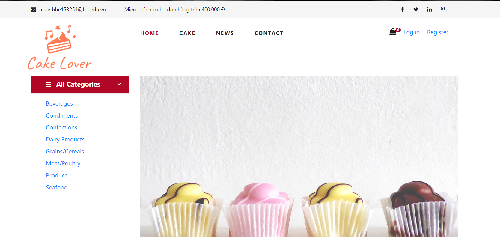
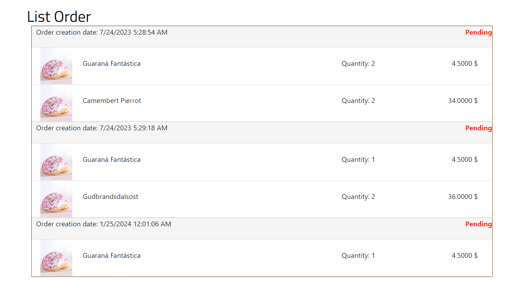
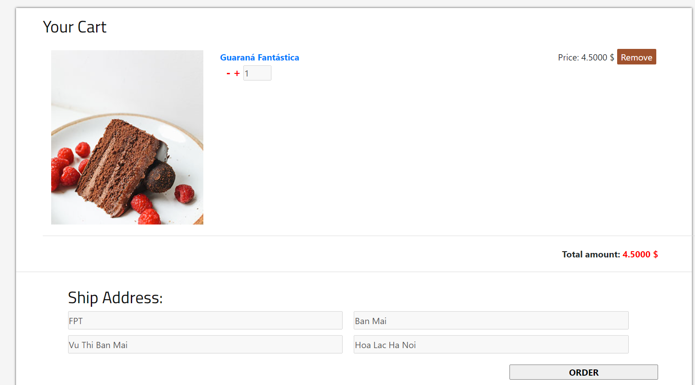

# VanillaCakeStore Repository
- This is a personal project about an online cake shopping website, done in the course PRN231 - Building Cross-Platform Back-End Application With .NET.
- Technical skills: ASP.NET Core 6.0, Restful API, Model Binding, MS SQL Server, HTML/CSS, Bootstrap...

